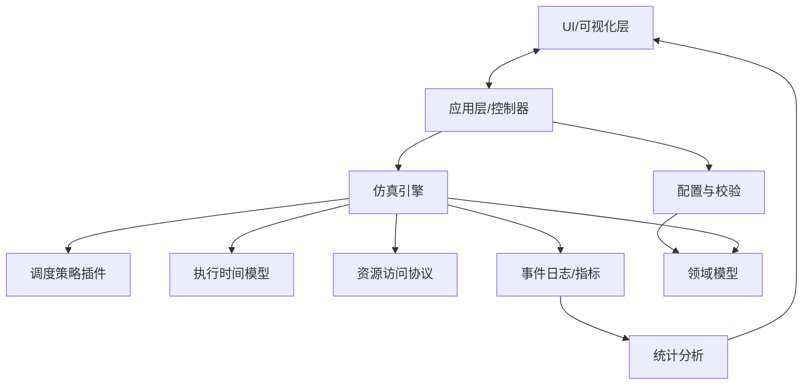

# 架构图草案与模块接口定义

## 1. 架构图草案（Mermaid）



## 2. 模块职责
- UI/可视化层：配置编辑、仿真控制、Gantt/指标展示
- 应用层/控制器：流程编排、会话状态管理、结果导出
- 配置与校验：解析配置、合法性检查、默认值补齐
- 仿真引擎：离散事件推进、段级执行、抢占/迁移、资源阻塞/唤醒
- 调度策略插件：算法逻辑与参数
- 执行时间模型：异构核速度/任务-核矩阵
- 资源访问协议：互斥、优先级继承/天花板等
- 事件日志/指标：统一事件与统计输出
- 领域模型：任务图、分段、资源、处理器、映射

## 3. 关键接口定义（草案）

### 3.1 配置与校验
```python
class IConfigParser:
    def load(path: str) -> ModelSpec: ...
    def save(spec: ModelSpec, path: str) -> None: ...
    def validate(spec: ModelSpec) -> list[ValidationIssue]: ...
```

### 3.2 仿真引擎
```python
class ISimEngine:
    def build(spec: ModelSpec) -> None: ...
    def run(until: float | None = None) -> None: ...
    def step(delta: float | None = None) -> None: ...
    def pause() -> None: ...
    def reset() -> None: ...
    def subscribe(handler: Callable[[SimEvent], None]) -> None: ...
```

### 3.3 调度策略插件
```python
class IScheduler:
    def init(context: ScheduleContext) -> None: ...
    def on_release(job: Job) -> None: ...
    def on_complete(job: Job) -> None: ...
    def on_segment_ready(seg: Segment) -> None: ...
    def schedule(now: float, cores: list[CoreState]) -> list[Decision]: ...
```

### 3.4 资源访问协议
```python
class IResourceProtocol:
    def request(seg: Segment, res: Resource) -> None: ...
    def release(seg: Segment, res: Resource) -> None: ...
    def on_block(seg: Segment, res: Resource) -> None: ...
    def on_wake(seg: Segment, res: Resource) -> None: ...
```

### 3.5 执行时间模型（ETM）
```python
class IExecutionTimeModel:
    def estimate(seg: Segment, core: Core, now: float) -> float: ...
    def on_exec(seg: Segment, core: Core, dt: float) -> None: ...
```

### 3.6 统计与分析
```python
class IAnalytics:
    def consume(event: SimEvent) -> None: ...
    def report() -> Metrics: ...
```

## 4. 数据流与时序（概要）
1. 读取配置 -> 校验 -> 构建领域模型
2. 初始化仿真引擎与调度器
3. 任务释放 -> 调度决策 -> 分段执行
4. 资源访问/阻塞/唤醒 -> 事件日志
5. 统计分析 -> UI 展示/导出
