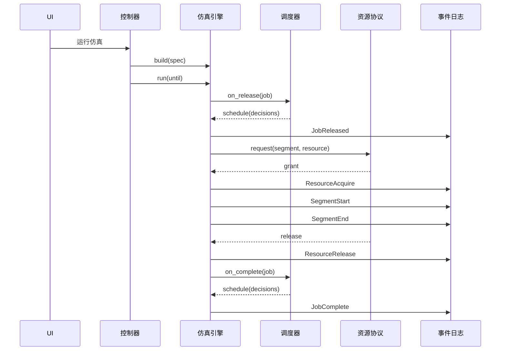
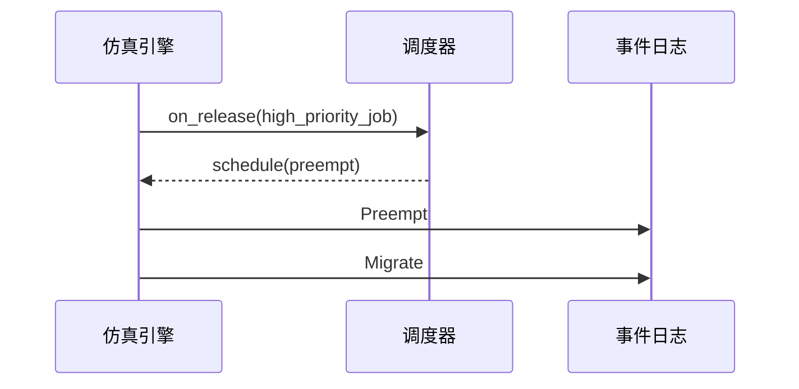
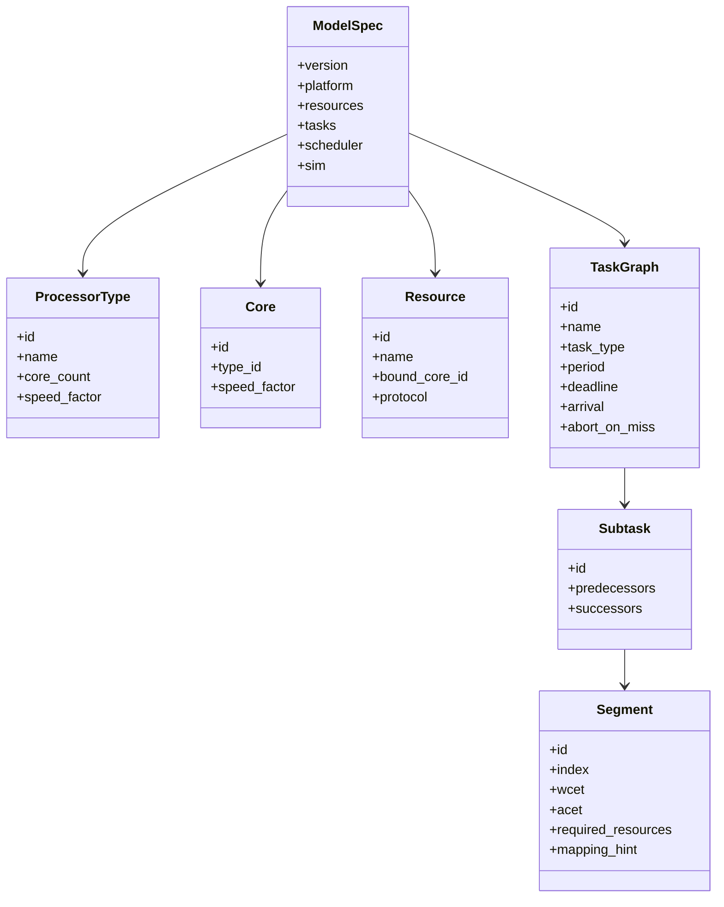

# 时序图与类图（Mermaid/UML 草案）

## 1. 任务释放与分段执行时序图

## 2. 抢占与迁移时序图（简化）

## 3. 领域模型类图（草案）

## 4. SimPy 映射关系（说明）
- Environment: 全局仿真时间基准
- Task/Segment: 可映射为进程协程
- Resource: 映射为 SimPy Resource/PreemptiveResource
- Scheduler: 驱动进程调度决策
