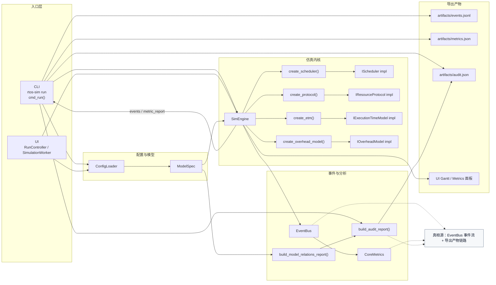
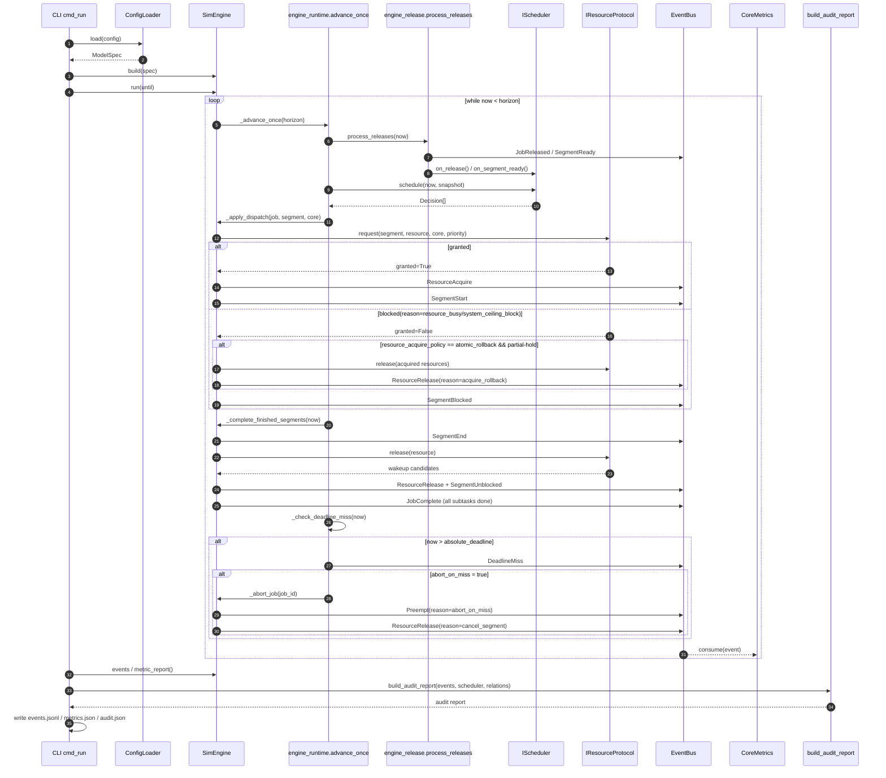
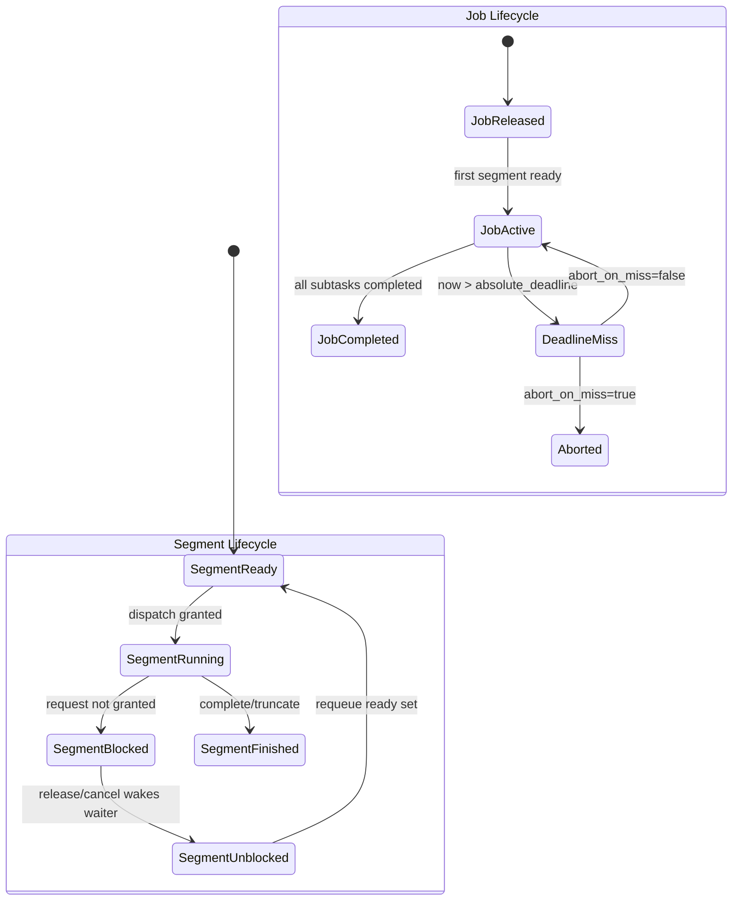
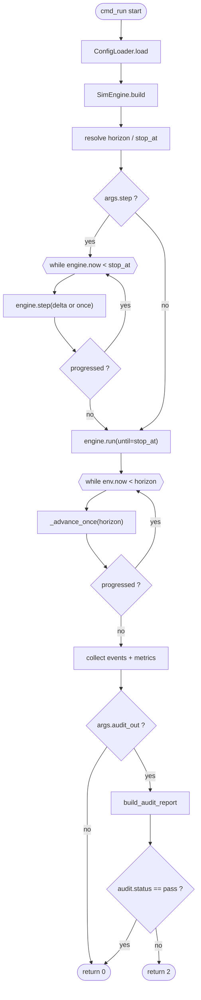
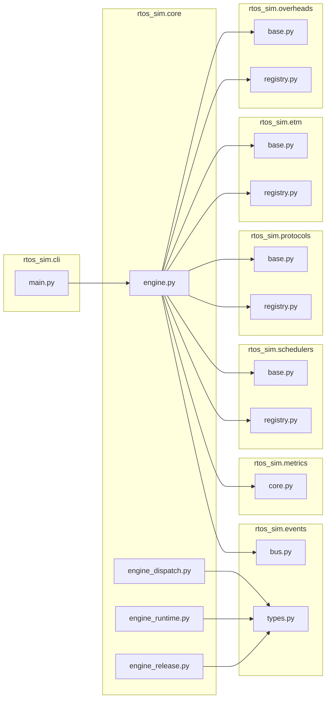
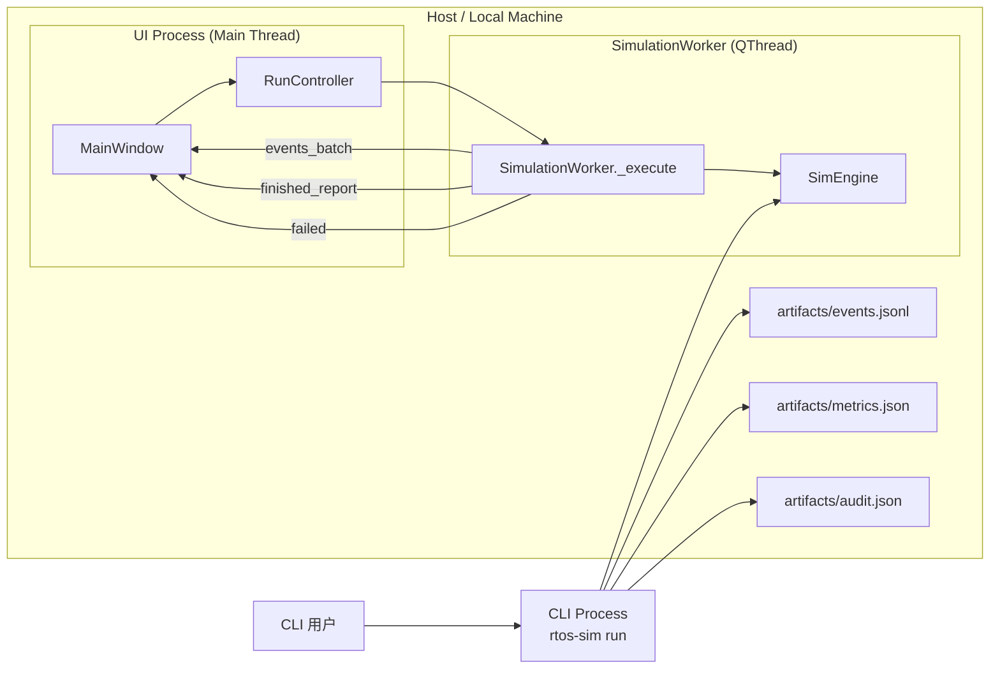
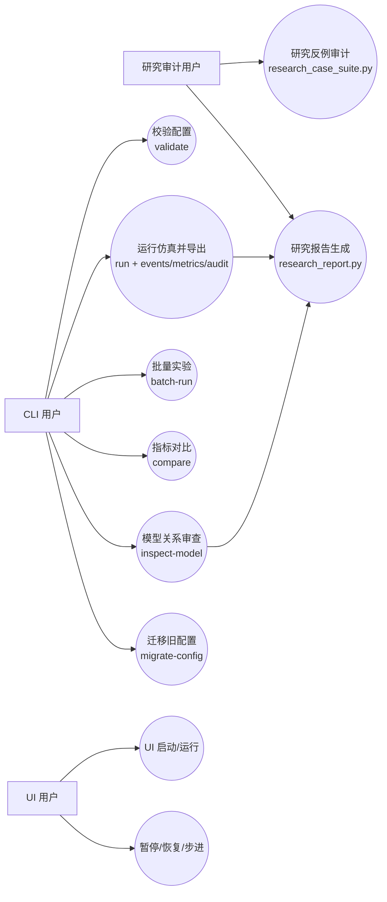
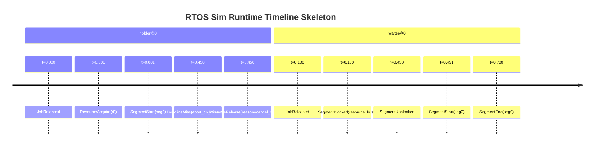

# 23-RTOS Sim 全栈 UML（Mermaid + PlantUML）

## 0. 代码映射表（绘图取证）

| 维度 | 参与者 | 角色说明 | 代码锚点 |
| --- | --- | --- | --- |
| 入口层 | CLI `cmd_run` | 加载配置、驱动 build/run、导出 events/metrics/audit | `rtos_sim/cli/main.py:199` |
| 入口层 | UI `RunController` + `SimulationWorker` | UI 触发运行、后台线程推进仿真并回传事件批次 | `rtos_sim/ui/controllers/run_controller.py:24`, `rtos_sim/ui/worker.py:16` |
| IO 层 | `ConfigLoader` | YAML/JSON -> `ModelSpec` 校验与迁移 | `rtos_sim/io/loader.py:30` |
| Core 层 | `SimEngine` | build 插件、run/step 循环、事件与运行态管理 | `rtos_sim/core/engine.py:86` |
| 调度/协议 | `IScheduler` / `IResourceProtocol` | 调度决策、资源请求/释放与阻塞唤醒 | `rtos_sim/schedulers/base.py:16`, `rtos_sim/protocols/base.py:31` |
| ETM/Overhead | `IExecutionTimeModel` / `IOverheadModel` | 执行时间估计与调度/迁移开销注入 | `rtos_sim/etm/base.py:8`, `rtos_sim/overheads/base.py:8` |
| 事件链路 | `EventBus` + `SimEvent` | 统一事件发布与序列化 envelope | `rtos_sim/events/bus.py:15`, `rtos_sim/events/types.py:28` |
| 指标/分析 | `CoreMetrics` + `build_audit_report` | 事件消费聚合指标 + 审计规则判定 | `rtos_sim/metrics/core.py:12`, `rtos_sim/analysis/audit.py:224` |

> PlantUML 对应源码：`docs/uml-src/23-fullstack-component.puml`、`docs/uml-src/23-sim-runtime-sequence.puml`、`docs/uml-src/23-core-runtime-class.puml`、`docs/uml-src/23-runtime-state-machine.puml`、`docs/uml-src/23-runtime-activity.puml`、`docs/uml-src/23-core-package.puml`、`docs/uml-src/23-cli-ui-deployment.puml`、`docs/uml-src/23-cli-ui-research-usecase.puml`、`docs/uml-src/23-runtime-timing.puml`

## 0.1 UML 资产治理约定
- `docs/uml-src/*.puml` 为 UML 权威源文件。
- `docs/uml-src/png` 与 `docs/uml-src/svg` 为可再生产物，用于展示与导出，不作为权威事实源。
- 当源码与导出图不一致时，以 `.puml` 为准重新生成图件。

## 1. L1 全栈架构关系图（Mermaid）

**代码锚点（L1）**
- `rtos_sim/cli/main.py:199`
- `rtos_sim/cli/main.py:239`
- `rtos_sim/cli/main.py:249`
- `rtos_sim/io/loader.py:30`
- `rtos_sim/core/engine.py:153`
- `rtos_sim/core/engine.py:161`
- `rtos_sim/events/bus.py:15`
- `rtos_sim/metrics/core.py:32`
- `rtos_sim/analysis/audit.py:224`
- `rtos_sim/ui/controllers/run_controller.py:24`
- `rtos_sim/ui/worker.py:16`

## 2. L2 仿真执行时序图（Mermaid）

**代码锚点（L2 时序）**
- `rtos_sim/cli/main.py:214`
- `rtos_sim/core/engine.py:193`
- `rtos_sim/core/engine_runtime.py:15`
- `rtos_sim/core/engine_release.py:16`
- `rtos_sim/core/engine_runtime.py:151`
- `rtos_sim/core/engine_dispatch.py:14`
- `rtos_sim/core/engine_dispatch.py:73`
- `rtos_sim/core/engine_dispatch.py:207`
- `rtos_sim/core/engine_dispatch.py:239`
- `rtos_sim/core/engine_runtime.py:202`
- `rtos_sim/core/engine_abort.py:15`
- `rtos_sim/events/types.py:12`

## 3. L2 核心接口/实现类图（Mermaid）

```mermaid
classDiagram
    class ISimEngine {
        <<interface>>
        +build(spec)
        +run(until)
        +step(delta)
        +pause()
        +resume()
        +stop()
        +reset()
    }
    class SimEngine
    SimEngine ..|> ISimEngine

    class IScheduler {
        <<interface>>
        +schedule(now, snapshot)
    }
    class PriorityScheduler
    class EDFScheduler
    class RMScheduler
    PriorityScheduler ..|> IScheduler
    EDFScheduler --|> PriorityScheduler
    RMScheduler --|> PriorityScheduler

    class IResourceProtocol {
        <<interface>>
        +configure(resources)
        +request(segment, resource, core, priority)
        +release(segment, resource)
    }
    class MutexResourceProtocol
    class PIPResourceProtocol
    class PCPResourceProtocol
    MutexResourceProtocol ..|> IResourceProtocol
    PIPResourceProtocol ..|> IResourceProtocol
    PCPResourceProtocol ..|> IResourceProtocol

    class IExecutionTimeModel {
        <<interface>>
        +estimate(...)
        +on_exec(...)
    }
    class ConstantExecutionTimeModel
    class TableBasedExecutionTimeModel
    ConstantExecutionTimeModel ..|> IExecutionTimeModel
    TableBasedExecutionTimeModel ..|> IExecutionTimeModel

    class IOverheadModel {
        <<interface>>
        +on_context_switch(...)
        +on_migration(...)
        +on_schedule(...)
    }
    class SimpleOverheadModel
    SimpleOverheadModel ..|> IOverheadModel

    class SchedulerRegistry {
        <<factory>>
        +create_scheduler(name, params)
    }
    class ProtocolRegistry {
        <<factory>>
        +create_protocol(name)
    }
    class ETMRegistry {
        <<factory>>
        +create_etm(name, params)
    }
    class OverheadRegistry {
        <<factory>>
        +create_overhead_model(name, params)
    }

    SchedulerRegistry ..> IScheduler
    ProtocolRegistry ..> IResourceProtocol
    ETMRegistry ..> IExecutionTimeModel
    OverheadRegistry ..> IOverheadModel

    SimEngine --> IScheduler
    SimEngine --> IResourceProtocol
    SimEngine --> IExecutionTimeModel
    SimEngine --> IOverheadModel
    SimEngine ..> SchedulerRegistry : build()
    SimEngine ..> ProtocolRegistry : build()
    SimEngine ..> ETMRegistry : build()
    SimEngine ..> OverheadRegistry : build()
```

**代码锚点（L2 类图）**
- `rtos_sim/core/interfaces.py:12`
- `rtos_sim/core/engine.py:86`
- `rtos_sim/schedulers/base.py:16`
- `rtos_sim/schedulers/base.py:36`
- `rtos_sim/schedulers/registry.py:28`
- `rtos_sim/protocols/base.py:31`
- `rtos_sim/protocols/registry.py:27`
- `rtos_sim/etm/base.py:8`
- `rtos_sim/etm/registry.py:26`
- `rtos_sim/overheads/base.py:8`
- `rtos_sim/overheads/registry.py:32`

## 4. L2 运行时状态机图（Mermaid）

**代码锚点（状态机）**
- `rtos_sim/core/engine_dispatch.py:88`
- `rtos_sim/core/engine_dispatch.py:92`
- `rtos_sim/core/engine_dispatch.py:269`
- `rtos_sim/core/engine_dispatch.py:273`
- `rtos_sim/core/engine_runtime.py:212`
- `rtos_sim/core/engine_runtime.py:223`
- `rtos_sim/core/engine_abort.py:24`
- `rtos_sim/core/engine.py:736`
- `rtos_sim/model/runtime.py:66`

## 5. L2 运行活动图（Mermaid）

**代码锚点（活动图）**
- `rtos_sim/cli/main.py:199`
- `rtos_sim/cli/main.py:214`
- `rtos_sim/cli/main.py:222`
- `rtos_sim/cli/main.py:224`
- `rtos_sim/cli/main.py:227`
- `rtos_sim/cli/main.py:232`
- `rtos_sim/core/engine.py:198`
- `rtos_sim/core/engine.py:201`
- `rtos_sim/core/engine_runtime.py:15`
- `rtos_sim/cli/main.py:248`
- `rtos_sim/cli/main.py:250`
- `rtos_sim/cli/main.py:256`

## 6. L2 包依赖图（Mermaid）

**代码锚点（包图）**
- `rtos_sim/core/engine.py:15`
- `rtos_sim/core/engine.py:16`
- `rtos_sim/core/engine.py:17`
- `rtos_sim/core/engine.py:28`
- `rtos_sim/core/engine.py:29`
- `rtos_sim/core/engine.py:30`
- `rtos_sim/core/engine_dispatch.py:7`
- `rtos_sim/core/engine_runtime.py:8`
- `rtos_sim/core/engine_release.py:9`

## 7. L2 部署图（Mermaid）

**代码锚点（部署图）**
- `rtos_sim/cli/main.py:199`
- `rtos_sim/cli/main.py:242`
- `rtos_sim/cli/main.py:248`
- `rtos_sim/ui/app.py:154`
- `rtos_sim/ui/controllers/run_controller.py:24`
- `rtos_sim/ui/controllers/run_controller.py:63`
- `rtos_sim/ui/controllers/run_controller.py:64`
- `rtos_sim/ui/controllers/run_controller.py:65`
- `rtos_sim/ui/controllers/run_controller.py:66`
- `rtos_sim/ui/worker.py:16`
- `rtos_sim/ui/worker.py:58`
- `rtos_sim/ui/worker.py:92`
- `rtos_sim/ui/app.py:2025`

## 8. L2 用例图（Mermaid）

**代码锚点（用例图）**
- `rtos_sim/cli/main.py:415`
- `rtos_sim/cli/main.py:424`
- `rtos_sim/cli/main.py:445`
- `rtos_sim/cli/main.py:457`
- `rtos_sim/cli/main.py:466`
- `rtos_sim/cli/main.py:477`
- `rtos_sim/ui/controllers/run_controller.py:44`
- `rtos_sim/ui/controllers/run_controller.py:77`
- `rtos_sim/ui/controllers/run_controller.py:84`
- `rtos_sim/ui/controllers/run_controller.py:91`
- `scripts/research_case_suite.py:142`
- `scripts/research_report.py:38`

## 9. L2 时间图（Mermaid Timeline）

**代码锚点（时间图）**
- `rtos_sim/core/engine_release.py:86`
- `rtos_sim/core/engine_dispatch.py:132`
- `rtos_sim/core/engine_dispatch.py:188`
- `rtos_sim/core/engine_dispatch.py:92`
- `rtos_sim/core/engine_dispatch.py:273`
- `rtos_sim/core/engine_runtime.py:212`
- `rtos_sim/core/engine_abort.py:94`
- `rtos_sim/core/engine.py:630`

## 10. PlantUML 源码对应关系

- L1 组件图：`docs/uml-src/23-fullstack-component.puml`
- L2 运行时序：`docs/uml-src/23-sim-runtime-sequence.puml`
- L2 核心类图：`docs/uml-src/23-core-runtime-class.puml`
- L2 运行时状态机图：`docs/uml-src/23-runtime-state-machine.puml`
- L2 运行活动图：`docs/uml-src/23-runtime-activity.puml`
- L2 包依赖图：`docs/uml-src/23-core-package.puml`
- L2 部署图：`docs/uml-src/23-cli-ui-deployment.puml`
- L2 用例图：`docs/uml-src/23-cli-ui-research-usecase.puml`
- L2 时间图：`docs/uml-src/23-runtime-timing.puml`
